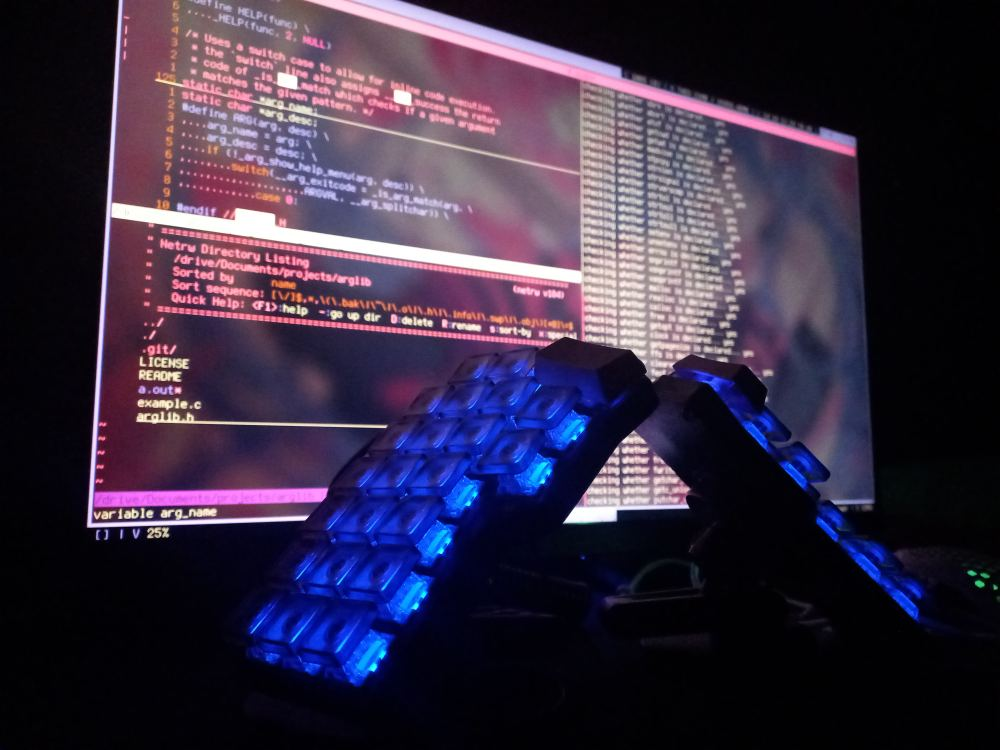

# `crkbd_qmk`
> My custom keymap for QMK-enabled foostan Corne V4.1's.


More images in the `alt/` folder.

## Layout:

> Combos are annoying on the keymap drawer so here is a list of QMK combos, generated using `make combos`

```bash
KC_D, KC_F, = KC_GRV
KC_Z, KC_X, = S(KC_9)
KC_X, KC_C, = S(KC_LBRC)
KC_C, KC_V, = KC_LBRC
KC_J, KC_K, = KC_BSL
KC_DOT, KC_SLSH, = S(KC_0)
KC_COMM, KC_DOT, = KC_RBRC
KC_M, KC_COMM, = S(KC_RBRC)
KC_SPC, KC_ENT, = KC_CAPS
```

## flashing
QMK does not work correctly with my system, specifically QMK flashing. To remedy this I've written a custom script (`src/flash`) that correctly flashes the new firmware to the board."
<br></br>
To flash the firmware just run the following:
```
make flash
```
You will be prompted for sudo at one point, please ensure you have read the `Makefile` and the `src/flash` file.
