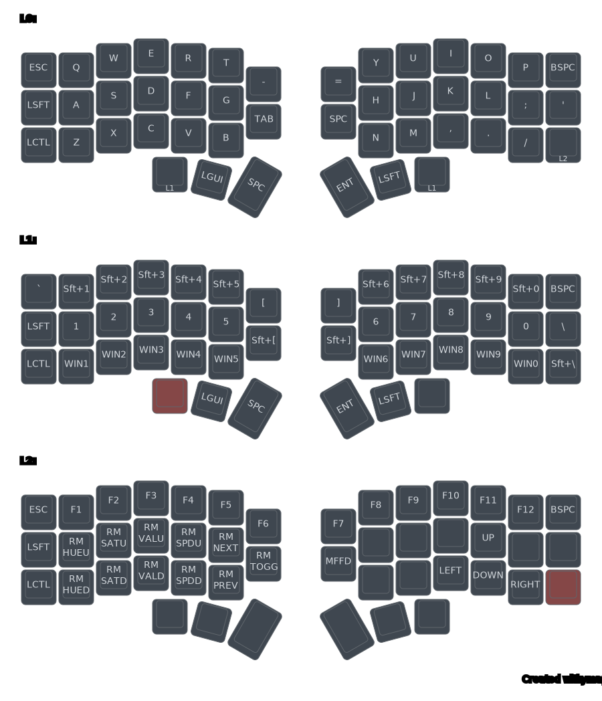

Hello! This is my custom configuration of my Corne V4.1 (46 keys) for QMK. Because of my specific Linux distro, I needed to write a custom loader for the keyboard device. Mostly because the Redhat cuck-ware; udev, does not work.
<br><br>
I've set this up for portability. Please read the Makefile for more
information.
<br>
```
|-- Makefile        <- read this for more options
|-- README
|-- layout
|   |-- default.vil <- older vial layout (will not be updated)
|   |-- display.svg <- image of layers!
|   |-- layout.json
|   `-- layout.yaml
`-- x3hy
    |-- config.h
    |-- keymap.c
    `-- rules.mk

3 directories, 9 files
```
