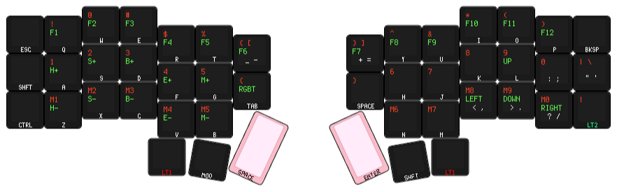

# `crkbd_qmk`
> My custom keymap for QMK-enabled foostan Corne V4.1's.
Because of the Redhat cuck-ware known as `udevd`, QMK does not work correctly with my system and is unable to locate and mount the RPI device in order to flash firmware. To remedy this, I've written a custom recipe in the `Makefile` of this project, that will locate, mount and flash the keyboard. To ensure safety of your machines HID devices, please ensure that only one device is listed as "`RPI-RP2`". Please read the "`flash`" recipe in the `Makefile`, ensure that this behavior will not break any other HID devices on your machine.
<br><br>
Layout:

<br>
```
|-- Makefile        <- read this for more options
|-- README
|-- layout
|   |-- default.vil <- older vial layout (will not be updated)
|   |-- display.svg <- image of layers!
|   |-- layout.json
|   `-- layout.yaml
`-- x3hy
    |-- config.h
    |-- keymap.c
    `-- rules.mk

3 directories, 9 files
```
